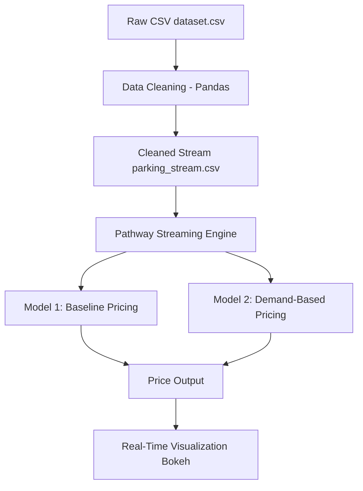

# Summer_Analytics_2025_IIT
An Event Held By Consulting &amp; Analytics Club, IIT Guwahati

# 🚗 Dynamic Pricing for Urban Parking Spaces (Real-Time with Pathway)

## 🚀 Github File

[Code File](https://github.com/IshanSrivastav/Summer_Analytics_2025_IITG/blob/main/Assesment/FinalAssesment.ipynb)

## 📂 Dataset

[Download dataset.csv](https://github.com/IshanSrivastav/Summer_Analytics_2025_IITG/blob/main/Assesment/dataset.csv)

This project simulates real-time dynamic pricing for urban parking lots using Pathway's stream processing engine. The system ingests streaming data, computes demand-based features, and outputs pricing predictions in real time with interactive Bokeh visualizations.

---

## 📦 Tech Stack

| Tool        | Purpose                              |
|-------------|---------------------------------------|
| **Python**  | Data transformation & logic           |
| **Pathway** | Real-time data stream processing      |
| **Pandas**  | Initial data cleaning and formatting  |
| **Bokeh**   | Interactive plotting & real-time charts |
| **Google Colab** | Cloud execution environment     |

---

## 📊 Architecture Overview

---

## ⚙️ Models Used

### 🔹 Model 1: Baseline Linear Pricing

A simple linear model to serve as a pricing baseline.

**Formula:**

price = BASE_PRICE + α × (occupancy / capacity) 

**Behavior:**  
Linearly increases price with occupancy.

---

### 🔹 Model 2: Demand-Based Pricing

A more advanced pricing model using multiple real-time demand indicators.

**Demand Factors:**

- Occupancy  
- Queue Length  
- Traffic Level  
- Special Day (binary)  
- Vehicle Type (weight-based)

**Price Formula:**

price = BASE + (normalized_demand × λ × BASE)

**Weights Used:**

- Occupancy: `0.4`  
- Queue: `0.3`  
- Traffic: `0.15`  
- Special Day: `0.1`  
- Vehicle Type: `0.05`

---

## 📉 Visualizations

Real-time interactive **Bokeh** plots display predicted prices for each parking lot.

- Each lot is shown in a **dedicated Panel tab**
- Plots **update automatically** as new data arrives via Pathway streaming
- Uses **tumbling daily windows** (`1-day interval`) for aggregation

